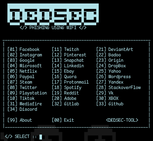

# dedsec-wifiphish_v2
It can create fake access points and create captive portal to redirect users to the fake login page.
### menu

### INSTALLATION
* git clone https://github.com/0xbitx/dedsec-wifiphish_v2.git
* cd dedsec-wifiphish_v2
* sudo bash dedsec-phish-v2.sh

### TESTED ON FOLLOWING:
* Kali Linux
* Parrot OS
* Ubuntu
* Arch Linux

### PREREQUISITES
* sudo - [ MUST ]
* wifi adapter support AP mode

### LANGUAGE 
* Bash Script

### DISCLAIMER
                                       TO BE USED FOR EDUCATIONAL PURPOSES ONLY

The use of the dedsec-wifiphish is COMPLETE RESPONSIBILITY of the END-USER. Developers assume NO liability and are NOT responsible for any misuse or damage caused by this program. 
